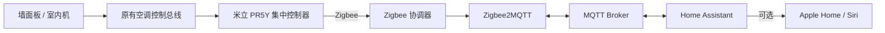

# 米立开关与 PR5Y 空调接入 Home Assistant 教程

版本：1.2.0
状态：实验性，但核心控制链路已经过真实设备闭环验证

第一次接触 Home Assistant、Zigbee2MQTT 或不知道先买什么，请先读
`HUMAN-GUIDE.md`。它按购买、安装、网页操作、设备迁移、Apple Home 和 AI
协作的顺序编写。

这份教程包含两条路线：

1. 普通米立 Zigbee 墙壁开关迁移到 Zigbee2MQTT 和 Home Assistant。
2. 米立中央空调集中控制器 PR5Y 通过专用 converter 接入多个 HA Climate。

墙壁开关的小白教程见 `docs/MILI-SWITCH.md`。本文主体继续讲解需要代码适配的
PR5Y 空调，可选步骤还可以把设备发布到 Apple Home 和 Siri。

本包不含任何真实家庭的 IP、MAC、Zigbee IEEE、房间名称、HomeKit 配对信息或
密钥。使用者只需填写一份本地 `config.json`，生成器会产出适配自己环境的文件。

## 1. 先确认是不是同一种设备

普通三路墙壁开关已验证指纹为 `TS0003 / _TZ3000_juccdfpb`，Zigbee2MQTT
原生支持，不需要 PR5Y converter。请按 `docs/MILI-SWITCH.md` 操作。

PR5Y converter 目前只验证过以下 Zigbee 指纹：

```text
Zigbee model: TS0603
manufacturer: _TZF200_wkmsnr09
Tuya product identifier: rpk52nw5
converter model: PR5Y
```

只有指纹一致时才应直接使用本包。外壳、App 名称或“米立空调控制器”名称相同，
不代表内部协议一定相同。

配对成功后可在 Zigbee2MQTT 设备页的“关于”或日志中查看 `modelID` 和
`manufacturerName`。如果不一致，请停止部署，把日志交给熟悉
Zigbee2MQTT external converter 的人或 AI 分析，不要硬套本 converter。

## 2. 能做什么

每个已配置区域提供：

- 开机和关机
- 目标温度，16-30 摄氏度，1 摄氏度步进
- 当前室温
- 制冷、制热、除湿、送风
- 低、中、高三档协议风速
- 物理墙面板、Zigbee2MQTT、HA 之间的状态回传
- 可选的 HA 延时关闭脚本和定时面板
- 可选的 Apple Home 温控器与 Siri 控制

不会伪造以下能力：

- 自动模式：已验证的墙面板没有该模式
- 0.5 摄氏度：PR5Y 的 Zigbee DP 只可靠传递整数
- 六档独立风速：部分面板虽然显示六档，但协议只传递三组
- 节能按钮：当前没有观察到可独立读写的 Zigbee DP

## 3. 架构



PR5Y 在 Zigbee 网络中只有一个设备，但它内部代理多个“三级设备地址”。本包把
这些地址拆成多个 HA Climate。

## 4. 硬件前提

必需：

1. 一台指纹匹配的米立 PR5Y，且它仍正确连接原有空调控制总线。
2. 一个 Zigbee2MQTT 支持的协调器。
3. 一台可长期运行 Zigbee2MQTT、MQTT Broker 和 Home Assistant 的主机。
4. 操作者可以接触 PR5Y、墙面板和配电，出现问题时能恢复原厂网关。

推荐：

- 使用 Ethernet/PoE Zigbee 协调器，放在开阔位置，远离金属机柜和强 USB 3.0
  干扰源。
- 使用 UPS 或至少保证主机、交换机、协调器不会频繁掉电。
- 协调器设置固定 DHCP 租约。

如果使用 SMLIGHT SLZB-06M/06MU 一类 EFR32MG21 协调器，Zigbee2MQTT 通常使用：

```yaml
serial:
  port: tcp://192.168.1.40:6638
  adapter: ember
```

这里的地址只是示例，必须替换成自己的协调器地址。Zigbee2MQTT 的
[Ember 适配器文档](https://www.zigbee2mqtt.io/guide/adapters/emberznet.html)
和 SMLIGHT 文档都使用 6638 作为常见网络串口端口，实际仍以设备 Web UI 为准。

## 5. 软件前提

- 可正常运行的 Home Assistant
- 可正常运行的 MQTT Broker，推荐 Mosquitto
- 可正常运行的 Zigbee2MQTT
- 本地 Node.js 18 或更高版本，用于运行配置生成器
- Home Assistant 已添加 MQTT 集成

本包不限定 HA OS、Docker、Supervised 或虚拟机。只要能访问以下目录即可：

- Zigbee2MQTT 的 `configuration.yaml` 和同级 `external_converters/`
- Home Assistant 的 `configuration.yaml`

官方参考：

- [Zigbee2MQTT external converters](https://www.zigbee2mqtt.io/advanced/more/external_converters.html)
- [Zigbee2MQTT enable_external_js](https://www.zigbee2mqtt.io/guide/configuration/all-settings.html#enable-external-js)
- [Home Assistant MQTT](https://www.home-assistant.io/integrations/mqtt/)
- [Home Assistant MQTT Climate](https://www.home-assistant.io/integrations/climate.mqtt/)
- [Home Assistant HomeKit Bridge](https://www.home-assistant.io/integrations/homekit/)

External converter 会在 Zigbee2MQTT 进程内执行 JavaScript。只运行你已经审阅或
信任的代码，不要从聊天或论坛直接粘贴来源不明的 converter。

## 6. 迁移前检查

在动设备之前完成：

1. 记录原 App 中每个空调区域的名称、当前模式、温度、风速和自动化。
2. 拍照保存 PR5Y、墙面板、空调型号和接线。
3. 备份 Zigbee2MQTT 的 `configuration.yaml`、`database.db`、协调器网络参数。
4. 备份 HA 配置目录，尤其是 `configuration.yaml` 和 `.storage`。
5. 确认原厂网关仍可恢复，且没有删除原 App 中的设备记录。
6. 选择一个不影响睡眠、老人、儿童或设备安全的时段。

不要在迁移时同时修改 Wi-Fi、DHCP、DNS、MQTT、HA 和 Zigbee channel。每次只变更
一层，确认稳定后再继续。

## 7. 让 PR5Y 加入 Zigbee2MQTT

1. 在 Zigbee2MQTT 中打开 Permit join，建议只开放 2-5 分钟。
2. 按对应批次说明书，让 PR5Y 进入恢复出厂或 Zigbee 配网模式。
3. 等待 interview 完成后立即关闭 Permit join。
4. 核对设备指纹必须与第 1 节一致。
5. 记录自己的设备 IEEE，例如 `0x` 开头的 16 位十六进制地址。
6. 暂时不要从原厂 App 删除历史数据。

不同批次的物理按键流程可能不同，本教程不猜测配网按键组合。找不到说明书时，
先观察指示灯和 Zigbee2MQTT 日志，避免反复断电或长按未知按钮。

## 8. 生成自己的配置

在本包目录操作：

```sh
cp config.example.json config.json
```

编辑 `config.json`：

- `device.ieeeAddress`：刚才记录的真实 IEEE
- `device.friendlyName`：Zigbee2MQTT 中使用的稳定名称，建议只用 ASCII
- `zones`：三级地址、稳定 key、显示名称
- `mqtt`：只有修改过 Zigbee2MQTT base topic 时才需要改
- `homeAssistant.entityPrefix`：HA 实体 ID 的稳定前缀

默认地址 `0x0101` 到 `0x0104` 是已验证设备的布局，但别人的安装不一定相同。
第一次可以保留四个默认地址，让 converter 发起注册和状态查询；随后以
`tertiary_device_addresses` 和日志中实际出现的地址为准。删除不存在的区域，
添加新区域后重新生成。

运行：

```sh
node tools/generate-config.mjs config.json build
```

生成目录包含：

```text
build/
  mili-hvac-pr5y.js
  zigbee2mqtt-device.yaml
  home-assistant-mqtt.yaml
  home-assistant-package.yaml
  home-assistant-dashboard.yaml
  homekit-filter-fragment.yaml
  manifest.json
```

`manifest.json` 是给人和 AI 使用的机器可读清单，记录设备指纹、区域配置和所有
生成文件的 SHA-256。

## 9. 安装 Zigbee2MQTT converter

1. 将 `build/mili-hvac-pr5y.js` 放到 Zigbee2MQTT 数据目录下的
   `external_converters/`。
2. 把 `build/zigbee2mqtt-device.yaml` 中的设备项合并进现有
   `configuration.yaml` 的 `devices:`，不要创建第二个 `devices:`。
3. 确认配置中启用 external JavaScript：

```yaml
advanced:
  enable_external_js: true
```

4. 重启 Zigbee2MQTT。
5. 查看启动日志，确认 converter 被加载，PR5Y 显示为 `PR5Y`。

不要整份覆盖现有 Zigbee2MQTT 配置，尤其不要覆盖：

- `network_key`
- `pan_id`
- `ext_pan_id`
- `database.db`
- 协调器 `serial` 设置

设备项中的 `retain: true` 很重要。HA 单独重启后，它可以立即收到最近一次聚合状态。

## 10. 注册内部空调并确认地址

在 Zigbee2MQTT 设备页找到 `register_tertiary_devices`，执行 `REGISTER`。然后执行
`query_tertiary_status` 的 `QUERY`。

预期看到：

- `tertiary_device_addresses` 出现一个或多个 `0xHHHH` 地址
- `tertiary_device_pid` 为 `rpk52nw5`
- 每个区域出现 `*_power`、`*_target_temperature`、`*_local_temperature`
- 改变物理墙面板后，MQTT 状态在数秒内更新

如果地址与 `config.json` 不同：

1. 修改 `zones[].address`。
2. 确保每个 `key` 唯一且以后不随房间改名。
3. 重新生成并替换 converter。
4. 重启 Zigbee2MQTT，再次注册和查询。

## 11. 安装 Home Assistant Climate

把 `build/home-assistant-mqtt.yaml` 放入 HA 配置目录，例如：

```text
/config/mqtt-pr5y-climates.yaml
```

如果 `configuration.yaml` 还没有 `mqtt:`，可以写：

```yaml
mqtt: !include mqtt-pr5y-climates.yaml
```

如果已经有 `mqtt:`，必须按 YAML 结构合并，不能再添加第二个顶层 `mqtt:`。

确认 HA 使用摄氏度：

```yaml
homeassistant:
  unit_system: metric
```

先运行 HA 的“检查配置”，通过后再重启。重启后搜索
`climate.<entityPrefix>_`，应能看到每个区域的温控器。

逐个确认：

1. HA 显示的开关状态与墙面板一致。
2. 当前温度和目标温度合理。
3. 只把目标温度改变 1 摄氏度，等待物理面板和 HA 回报，再恢复。
4. 切换一个风速档并恢复。
5. 模式测试必须给压缩机和四通阀足够等待时间。

## 12. 可选：延时关闭和仪表盘

把 `build/home-assistant-package.yaml` 放入 HA 的 packages 目录，并确保：

```yaml
homeassistant:
  packages: !include_dir_named packages
```

把 `build/home-assistant-dashboard.yaml` 注册为 YAML Dashboard，或将其中的
sections 合并到自己的仪表盘。

每个区域会得到：

- 一个可恢复的延时关闭 timer
- 一个通用“空调延时关闭”脚本
- 一个通用“取消空调延时关闭”脚本
- timer 到期后关闭对应 Climate 的自动化
- 30 分钟、1 小时、2 小时和取消按钮

## 13. 可选：Apple Home 和 Siri

推荐在 HA UI 中创建 HomeKit Bridge，然后只加入生成的 Climate 实体。具体实体
列表见 `build/homekit-filter-fragment.yaml`。

不要把 converter 暴露出的原始 power、DP、注册和查询实体发布到 Apple Home，
否则会出现一堆难以理解的平铺开关。只发布 Climate。

HA 官方文档说明 UI 创建的 HomeKit Bridge 应继续在 UI 中管理；不要再用 YAML
配置同一个桥，否则会创建另一个实例。Docker 部署通常应使用 host 网络，并允许
mDNS UDP 5353 和桥接端口。

HomeKit 的温控器模型通常只呈现关闭、降温、升温和自动。HA 中的除湿与送风可能
不会成为 Apple Home 的独立可选模式，这是 HomeKit 数据模型限制，不是 converter
丢了功能。

Siri 的“打开空调”不一定等于“沿用上次模式”。需要固定默认制冷时，可在 Apple
Home 创建与自然语句同名的场景，例如：

```text
打开区域 1 空调 -> 区域 1 Climate，制冷，26℃
```

明确的制热或温度命令仍交给原 Climate。先用一个区域验证场景名是否会与明确模式
命令冲突，再复制到其他区域。

## 14. 安全验收顺序

只读检查：

1. Zigbee2MQTT、MQTT、HA 都在线且没有重启循环。
2. converter 已加载。
3. retained MQTT 状态存在。
4. HA 配置检查通过。
5. 每个 Climate 可用，单位为摄氏度。

主动检查，每次只测一个区域和一个字段：

1. 目标温度加 1 摄氏度，再恢复。
2. 低、中、高风速各测试一次。
3. 关机状态测试模式写入。
4. 已开机跨模式时，确认墙面板会先关机清除旧模式，再以新模式启动。
5. 重启 Zigbee2MQTT，确认状态恢复。
6. 单独重启 HA，确认 retained 状态恢复。
7. 最后再测试 Apple Home 和 Siri。

禁止快速反复启停压缩机。以空调厂家要求的保护时间为准。

## 15. 回退

出现异常时：

1. 停止主动控制。
2. 保存 Zigbee2MQTT 日志和最近一条 MQTT 状态。
3. 恢复修改前的 Zigbee2MQTT 与 HA 配置。
4. 删除或停用 external converter。
5. 重启 Zigbee2MQTT 和 HA。
6. 必要时将 PR5Y 恢复到原厂网关。

不要为了“重新开始”删除整个 Zigbee 网络数据库或 HA `.storage`。这会影响与本次
实验无关的设备和 HomeKit 配对。

## 16. 常见问题

### PR5Y 配对成功但没有内部空调

先执行 `REGISTER` 和 `QUERY`。PR5Y 是集中器，Zigbee interview 成功只代表外层
设备加入，不代表内部三级设备已经注册。

### HA 重启后全是未知状态

检查 PR5Y 设备项是否有 `retain: true`，以及 MQTT Broker 是否真正保留了
`<baseTopic>/<friendlyName>` 状态。

### 设置模式后没有开机

PR5Y 实测不能在同一条三级消息中可靠执行 DP4 和 DP1。本 converter 已分两条
发送。确认正在运行生成后的 converter，而不是旧文件。

### 物理面板同时亮制冷和制热

本 converter 在已开机跨模式时执行“关机、等待 2 秒、写模式、等待 0.5 秒、开机”。
检查日志和 SHA-256，确认没有部署旧版本。

### 六档面板在 HA 只有三档

协议会把物理 1/2、3/4、5/6 档分别压缩为低、中、高。当前无法可靠远程选择六个
独立位置。

### 27.5 摄氏度在 HA 变成 27

这是 PR5Y Zigbee 接口的已知限制，不要把 `temperatureStep` 改成 0.5，也不要把
温度乘以 10 下发。

### Apple Home 很乱

HomeKit Bridge 只包含 Climate。不要包含 Zigbee2MQTT 自动发现的原始 config 和
diagnostic 实体。

## 17. 给 AI 的入口

AI 应先阅读本目录的：

1. `AGENTS.md`
2. `config.json`，没有则读取 `config.example.json`
3. `docs/PROTOCOL.md`
4. `build/manifest.json`，如果已经生成

AI 不应自动读取或打包 HA `.storage`、Zigbee `network_key`、真实家庭拓扑或日志
中的其他设备。完整的机器执行边界写在 `AGENTS.md`。

## 18. 适用边界

这是针对自有设备的兼容性适配，不是对第三方 Zigbee 网络的攻击工具。只在自己有权
操作、能够物理回退的设备上使用。

本包不能代替空调电气施工规范。涉及强电、空调控制总线或未知接线时，应由有资质的
人员处理。
